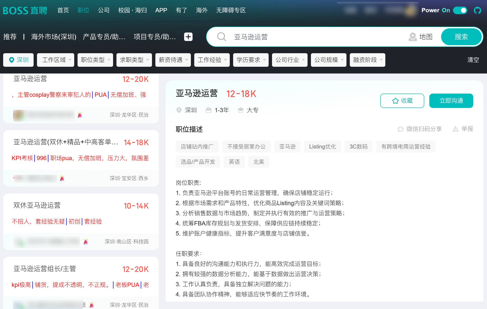
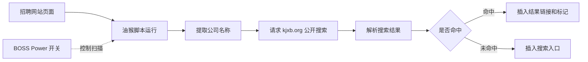

<a id="readme-top"></a>

[![License][license-shield]][license-url]
[![Issues][issues-shield]][issues-url]
[![Stars][stars-shield]][stars-url]

<br />
<div align="center">
  <a href="https://github.com/Stephen-Xu-X/bosszhipin_companyINFO">
    
  </a>

  <h3 align="center">BOSS直聘脚本</h3>

  <p align="center">
    面向 BOSS 直聘与前程无忧的<strong>部分跨境公司</strong>信息查询和岗位信息辅助显示油猴脚本。
    <br />
    <a href="#安装"><strong>查看安装方式 »</strong></a>
    <br />
    <br />
    <a href="https://github.com/Stephen-Xu-X/bosszhipin_companyINFO/issues">报告问题</a>
    ·
    <a href="https://github.com/Stephen-Xu-X/bosszhipin_companyINFO/issues">提出建议</a>
  </p>
</div>

## 项目展示

<p align="center">
  
</p>

<p align="right">(<a href="#readme-top">返回顶部</a>)</p>

<details>
  <summary>目录</summary>
  <ol>
    <li><a href="#项目展示">项目展示</a></li>
    <li><a href="#关于项目">关于项目</a></li>
    <li><a href="#功能">功能</a></li>
    <li><a href="#安装">安装</a></li>
    <li><a href="#使用说明">使用说明</a></li>
    <li><a href="#运行流程">运行流程</a></li>
    <li><a href="#数据来源">数据来源</a></li>
    <li><a href="#免责声明">免责声明</a></li>
    <li><a href="#开始开发">开始开发</a></li>
    <li><a href="#项目结构">项目结构</a></li>
    <li><a href="#更新日志">更新日志</a></li>
    <li><a href="#反馈">反馈</a></li>
    <li><a href="#许可证">许可证</a></li>
  </ol>
</details>

## 关于项目

本脚本在 BOSS 直聘和前程无忧页面中提供公司查询入口及岗位信息辅助显示。公司查询基于 [kjxb.org](https://kjxb.org/) 的公开搜索页面；未命中时会提供对应搜索入口。

<p align="right">(<a href="#readme-top">返回顶部</a>)</p>

## 功能

- BOSS 直聘搜索页、职位详情页、用户页和公司页显示公司查询入口。
- BOSS 页头提供 `Power On/Off` 开关，可即时暂停或恢复查询。
- 页头 GitHub 图标可直接打开本仓库。
- 前程无忧岗位列表显示岗位发布时间、学历和经验等页面已有信息。

<p align="right">(<a href="#readme-top">返回顶部</a>)</p>

## 安装

1. 在浏览器安装 [Tampermonkey](https://www.tampermonkey.net/) 或兼容的用户脚本管理器。
2. [点击安装脚本](https://raw.githubusercontent.com/Stephen-Xu-X/bosszhipin_companyINFO/refs/heads/main/scripts/bosszhipin-company-info.user.js)。
3. 若脚本管理器未自动打开安装页，打开 [scripts/bosszhipin-company-info.user.js](scripts/bosszhipin-company-info.user.js)，复制全部内容后新建脚本并保存。
4. 打开 BOSS 直聘或前程无忧页面即可运行。

> 脚本管理器会通过 GitHub Raw 检查更新；每次发布新版本时会递增脚本头部的 `@version`。

<p align="right">(<a href="#readme-top">返回顶部</a>)</p>

## 使用说明

- BOSS 页面右上角显示 `Power On/Off` 开关；关闭后会清除已插入的查询标记并暂停扫描。
- 查询结果来自外部公开页面，结果完整性与可用性取决于该站点。
- 脚本不会上传用户的账号、简历或浏览记录。

<p align="right">(<a href="#readme-top">返回顶部</a>)</p>

## 运行流程



<p align="right">(<a href="#readme-top">返回顶部</a>)</p>

## 数据来源

公司查询请求仅发送至 [kjxb.org](https://kjxb.org/) 的公开搜索页面。脚本会以页面中的公司名称构造搜索请求；未命中时提供对应搜索入口，方便用户自行查看。

<p align="right">(<a href="#readme-top">返回顶部</a>)</p>

## 免责声明

- 本脚本仅辅助展示公开页面中的查询结果，不对结果的真实性、完整性或时效性作保证。
- 查询结果仅供用户自行判断和参考，不构成招聘、投资、法律或其他专业建议。
- 本项目与 BOSS 直聘、前程无忧及 [kjxb.org](https://kjxb.org/) 均无官方关联。
- 使用者应自行遵守相关网站规则及适用法律法规。

<p align="right">(<a href="#readme-top">返回顶部</a>)</p>

## 开始开发

将以下内容复制给你的编码 Agent：

```text
克隆 https://github.com/Stephen-Xu-X/bosszhipin_companyINFO，并遵循 docs/DEVELOPMENT.md 中的说明。
```

<p align="right">(<a href="#readme-top">返回顶部</a>)</p>

## 项目结构

```text
.
├── LICENSE                                # GPL-3.0 开源许可证
├── README.md                              # 项目说明与安装指南
├── docs/
│   └── DEVELOPMENT.md                     # 开发、验证与发布说明
├── images/
│   └── boss.jpg                           # BOSS 页面展示图
└── scripts/
    └── bosszhipin-company-info.user.js   # 正式发布的油猴脚本
```

<p align="right">(<a href="#readme-top">返回顶部</a>)</p>

## 更新日志

### 脚本更新

#### 2.0.2

- 正式发布文件改为 `.user.js`，支持油猴一键安装。
- 自动更新地址改为完整的 `refs/heads/main` GitHub Raw 引用。

#### 2.0.1

- 接入 GitHub Raw 自动更新地址。
- 补充 Raw 一键安装入口。

#### 2.0.0

- 重构 BOSS 页头控制：新增 `Power On/Off` 开关和 GitHub 仓库入口。
- 修复反复切换开关后重复插入查询图标的问题。
- 移除油猴扩展菜单命令，统一脚本名称和启动文案。

### README 文档更新

#### 2026-07-17

- 新增 BOSS 页面展示图。
- 补充数据来源、免责声明与脚本运行流程图。
- 新增开发说明和项目结构说明。

<p align="right">(<a href="#readme-top">返回顶部</a>)</p>

## 反馈

问题反馈和功能建议请通过 [Issues][issues-url] 提交。

<p align="right">(<a href="#readme-top">返回顶部</a>)</p>

## 许可证

本项目采用 [GPL-3.0][license-url] 许可证。

<p align="right">(<a href="#readme-top">返回顶部</a>)</p>

<!-- Markdown reference links -->
[license-shield]: https://img.shields.io/github/license/Stephen-Xu-X/bosszhipin_companyINFO.svg?style=for-the-badge
[license-url]: https://github.com/Stephen-Xu-X/bosszhipin_companyINFO/blob/main/LICENSE
[issues-shield]: https://img.shields.io/github/issues/Stephen-Xu-X/bosszhipin_companyINFO.svg?style=for-the-badge
[issues-url]: https://github.com/Stephen-Xu-X/bosszhipin_companyINFO/issues
[stars-shield]: https://img.shields.io/github/stars/Stephen-Xu-X/bosszhipin_companyINFO.svg?style=for-the-badge
[stars-url]: https://github.com/Stephen-Xu-X/bosszhipin_companyINFO/stargazers
